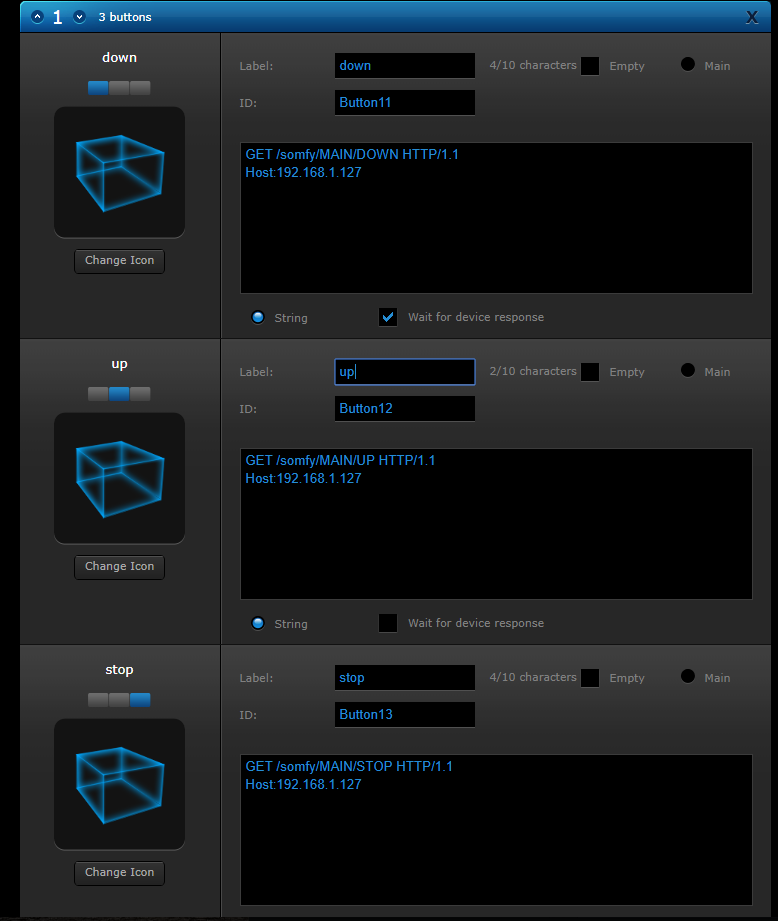

# somfy-rest-api
Control any somfy blinds with a REST API to be used with e.g. Amazon Alexa or Fibaro HC

# Functionality

This project provides a REST interface to control your somfy blinds. You can control any somfy stuff that uses Somfy Smoove Origin RTS Protocol.
You need a Raspberry PI and a 433 MHZ transmitter.

This project contains three parts:

## Part 1: Python Script to control blinds
See [README](somfy-control-script/README.md) for installation and information.
This is based on [Pi-Somfy](https://github.com/Nickduino/Pi-Somfy)

## Part 2: Spring Boot Application for REST Interface
Provides the REST API to the python script

## Part 3: Optional AWS Lambda
You can also integrate the provided REST API with Amazon Alexa. See [README](aws-lambda/README.md).
This will provide a speech interface like:

Alexa, turn blinds on.
Alexa, turn blonds off.

## Commands

Format:

http://localhost:8080/somfy/{channel}/{command} 

e.g.

* http://localhost:8080/somfy/MAIN/UP 
* http://localhost:8080/somfy/MAIN/DOWN
* http://localhost:8080/somfy/MAIN/STOP

# Build REST API

`mvnw package`

## Run

`java -jar somfy-0.0.1-SNAPSHOT.jar`

## Install as service

Copy the pihub.service file to:

`/etc/systemd/system/pihub.service`
 
Reload systemd: 

`sudo systemctl daemon-reload`
 
Enable the service:

`sudo systemctl enable pihub.service`

Start the service:

`sudo systemctl start pihub.service`

Check Log:

`sudo journalctl --unit=pihub`

`tail -f /var/log/syslog | grep pihub`

# Integration in Fibaro
The integration in fibaro is quite easy. Just create a virtual device with three buttons and use this configuration:

